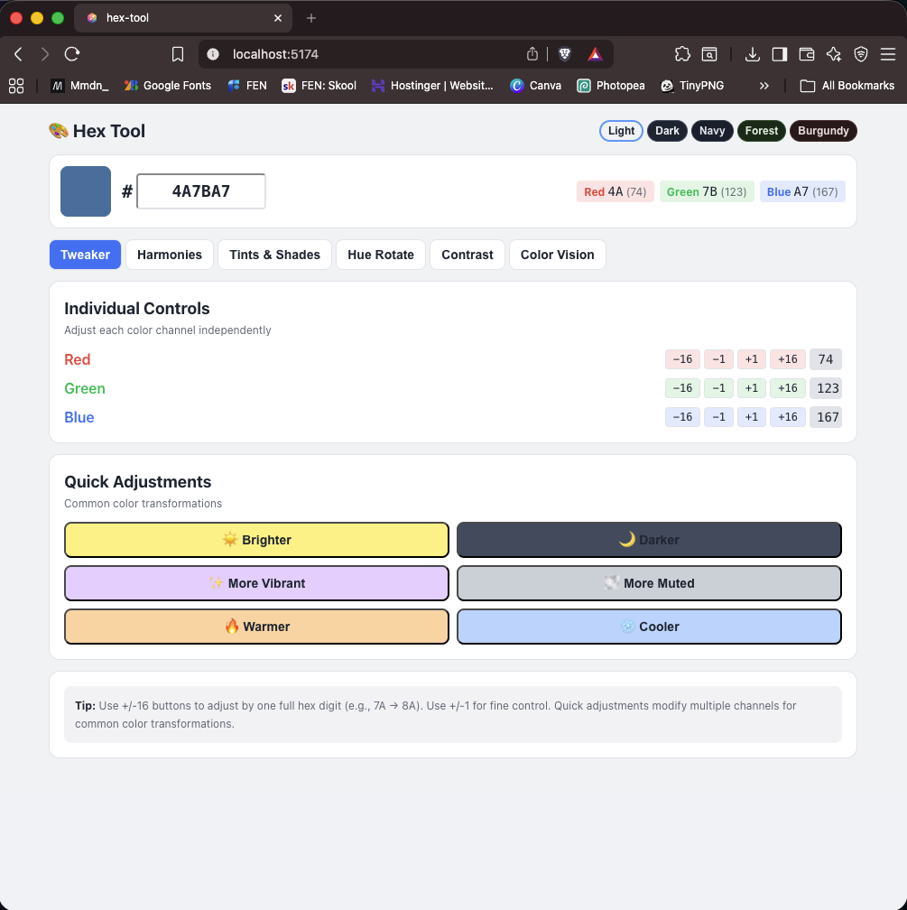

# 🎨 Hex Tool

A comprehensive web-based color tool for designers and developers. Learn how hex codes and color shifts work, explore color harmonies, test accessibility, and simulate color vision deficiencies — all in one place.



## 🌟 Features

### Current Features (v1.0)
- **Color Tweaker** - Precisely adjust RGB values individually or use quick presets (brighter, darker, warmer, cooler, etc.)
- **Color Harmonies** - Generate complementary, split-complementary, analogous, and triadic color schemes
- **Tints & Shades** - Create 10-step color scales using pure color mixing (no opacity) - great for backgrounds and linear gradients
- **Hue Rotation** - Visualize CSS `hue-rotate()` filter at 30° increments
- **Contrast Checker** - WCAG AA/AAA compliance testing with live preview
- **Color Vision Simulation** - Test how colors appear with protanopia, deuteranopia, and tritanopia
- **Theme Support** - 5 background themes for easy comparisons (Light, Dark, Navy, Forest, Burgundy)

### Planned updates (v1.0)
- **Styling** - Correct known visual issues, such as making "Darker" text lighter

## 🚀 Getting Started

### Prerequisites
- Node.js (v14 or higher)
- npm or yarn

### Installation

```bash
# Clone the repository
git clone https://github.com/SneauxGirl/hex-tool.git
cd hex-tool

# Install dependencies
npm install

# Start development server (built with Vite)
npm run dev
```

The app will open at the server listed in the terminal, typically`http://localhost:5173`

### Building for Production

```bash
npm run build
```

## 📚 Project Structure

```
hex-tool/
├── README.md                    # This file
├── docs/
│   ├── prototypes/             # Evolution of the project
│   │   ├── v1-basic-tweaker.jsx
│   │   ├── v2-with-harmonies.jsx
│   │   │    ├── v2-1-with-split-comp.jsx
│   │   ├── v3-add-shades-tints.jsx
│   │   ├── v4-setup-incremental-guide.md
│   │   └── README.md           # Development - Archival
│   ├── CHANGELOG.md            # Detailed version history
│   └── screenshots/            # Visual documentation
├── public/
│   ├── index.html
│   ├── hex-tool-tnsp-favicon.io  #Favicon - transparent background 
│   └── favicon.ico             # Favicon - white background
├── src/
│   ├── App.jsx                 # Main application component
│   ├── index.js                # Entry point
│   ├── index.css               # Global styles
│   ├── components/             # Feature components
│   │   ├── Tweaker.jsx         # RGB adjustment controls
│   │   ├── Harmonies.jsx       # Color harmony generator
│   │   ├── TintsShades.jsx     # Tint and shade scale
│   │   ├── HueRotate.jsx       # Hue rotation preview
│   │   ├── Contrast.jsx        # WCAG contrast checker
│   │   ├── ColorVision.jsx     # CVD simulation
│   │   └── shared/             # Reusable components
│   │       ├── Card.jsx
│   │       └── Swatch.jsx
│   ├── utils/
│   │   ├── colorUtils.js       # Color conversion & manipulation
│   │   └── constants.js        # Theme definitions, CVD matrices
│   └── hooks/                  # Custom React hooks (future)
├── package.json
└── .gitignore
```

## 🎓 How It Started

This project began as a series of Claude.ai artifacts while I was learning about hex color codes and color theory. The evolution is documented in `docs/prototypes/`:

1. **v1** - Basic hex tweaker with RGB sliders
2. **v2** - Added color harmonies (complementary, analogous, triadic)
3. **v2.1** - Added split complementary harmonies
4. **v3** - Added tints/shades
5. **v4, prod version 1.0.0** - Full suite with hue rotation, contrast checker, and CVD simulation

Each prototype shows the iterative design process and learning journey.

## 🎯 Learning Goals

This project was built to:
- Understand how hex codes work at the RGB level
- Learn color theory principles (harmonies, contrast, accessibility)
- Save myself time and frustration when precision color editing
- Practice scalable React component design and state management
- Document the entire development process

## 🛠️ Technologies Used

- **React** - UI framework
- **Tailwind CSS** (via inline styles) - Styling
- **JavaScript ES6+** - Logic and utilities
- No external color libraries - all algorithms implemented from scratch for learning

## 📖 Usage Guide

### Color Tweaker
1. Enter a hex code or use the color picker
2. Adjust individual RGB channels with +/- buttons
3. Use quick adjustment buttons for common transformations

### Color Harmonies
- Click any generated color to set it as your new base color
  Your prior base color will populate in its new harmonic space
- Use harmonies to build cohesive color palettes

### Tints & Shades
- Generate a full scale from light to dark
- Perfect for creating design system color scales and linear gradient mods
- Click any swatch to use it as your base

### Contrast Checker
- Automatically suggests a high-contrast pairing
- Edit the contrast color to test different combinations
- See WCAG compliance in real-time

### Color Vision Simulation
- Adjust severity slider from 0 (normal) to 1 (full color blindness)
- Compare original vs simulated colors side-by-side
- Test accessibility and appearance for color-blind users

### Theme Compatibility Switcher
- Toggle between 5 background themes for alt mode projects (Light, Dark, Navy, Forest, Burgundy)
- Edit themes in `src/utils/constants.js`

## 🤝 Contributing

This is a personal learning project, but suggestions and feedback are welcome! Feel free to:
- Open issues for bugs or feature requests
- Fork and experiment
- Share your own color tools for inspiration
- I expand this based on felt need - it might be done... but probably not

## 📝 License

MIT License - feel free to use this code for learning or your own projects

## 🙏 Acknowledgments

- Color theory education from various design resources
- WCAG contrast algorithms from W3C specifications
- CVD simulation using Brettel method (simplified)
- Built with guidance from Claude.ai during the learning process

## 📞 Contact

- GitHub: [@SneauxGirl](https://github.com/Sneaux)
- Project Link: [https://github.com/SneauxGirl/hex-tool](https://github.com/SneauxGirl/hex-tool)

---